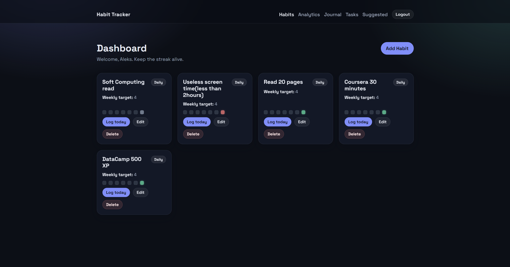
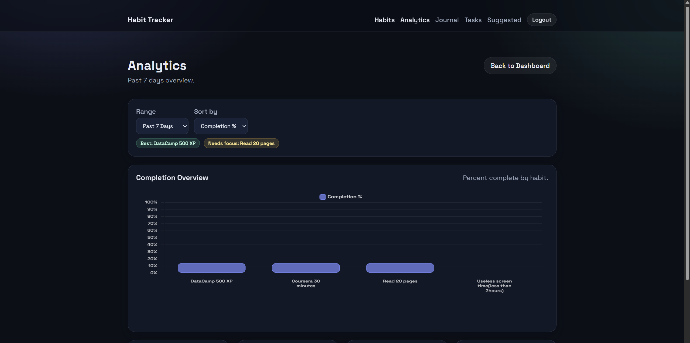
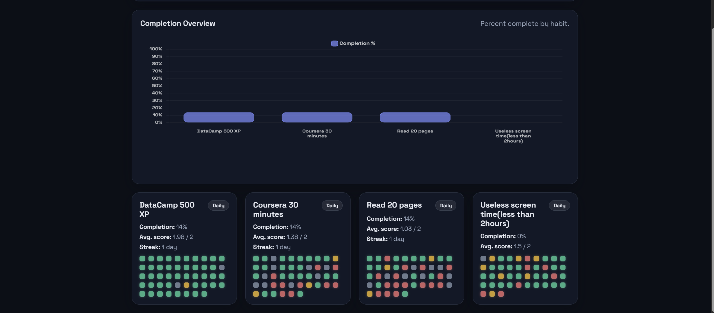
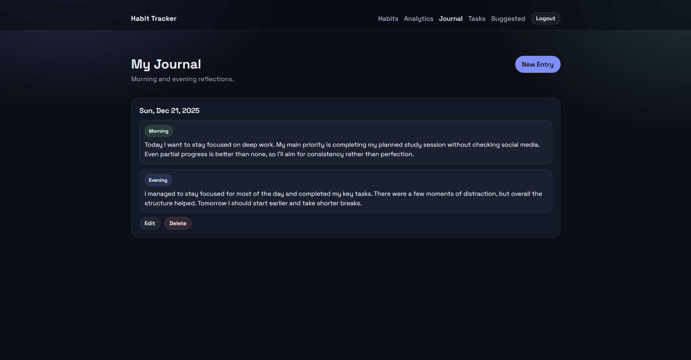
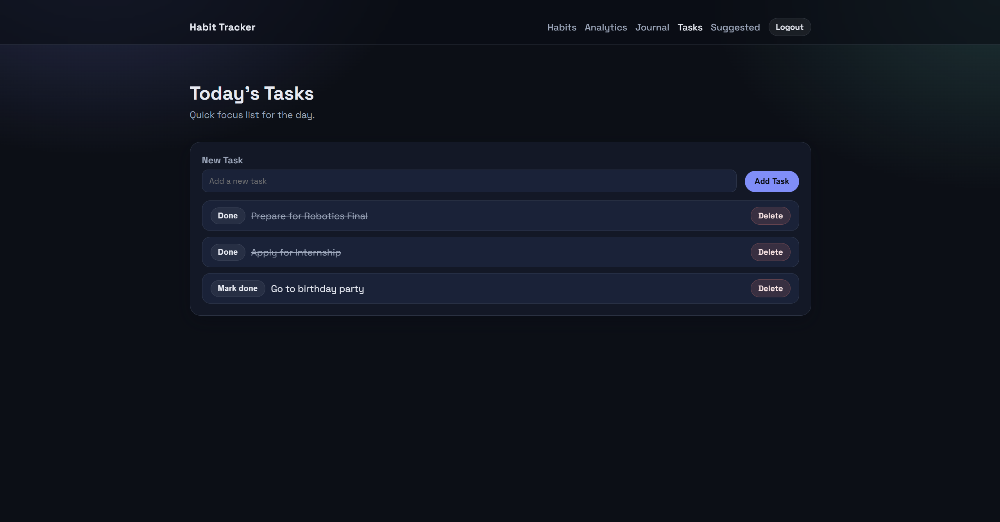

# Habit Tracker App
A personal habit system focused on honest progress: track, reflect, and learn from real-world consistency.

## Why this project exists
Most habit trackers reduce behavior to a binary done/not-done streak. That works for simple routines, but it ignores reality: some days are partial wins, some are planned breaks, and most need context to make sense. Habit Tracker App exists to capture that nuance. It blends lightweight tracking with reflection and analytics so progress is measured as a signal over time, not just a streak count.

## Core concept / mental model
Habit Tracker App treats each habit as a rolling signal:
- Daily logs capture **quality** (completed, partial, missed, off).
- Heatmaps and trends visualize **consistency**.
- Morning and evening journaling provide **context**.
- Daily tasks capture **short-term focus**.

The system is designed around a simple loop: log → reflect → review → adjust.

## Screenshots
Screenshots will be added to `/screenshots`.


*Dashboard: habit cards with heatmaps and quick actions.*



*Analytics: completion percentages, streaks, and trend graphs.*


*Journal: morning and evening reflection blocks.*


*Tasks: a daily list with simple completion toggles.*

## Features

### Habit tracking & scoring
Habits are logged as **completed**, **partial**, **missed**, or **off**. This makes progress more truthful: partial effort still counts, and planned breaks do not distort the data. The scoring model feeds into streaks, averages, and analytics.

### Analytics & trends
Analytics highlight completion rates, average scores, streaks, and trendlines over 7- or 30-day ranges. The emphasis is on direction and consistency, not just raw totals.

### Journaling (morning vs evening)
Journaling is split into morning and evening notes to capture intent and reflection. This keeps the app grounded in daily context and makes patterns easier to interpret.

### Daily tasks
A lightweight daily to-do list sits alongside habits. It is intentionally simple and resets each day to keep focus tight.

### Admin capabilities
Admin views include user management, suggested habit templates, and system analytics (total users/logs, most active users). This is a portfolio feature to demonstrate role-based access and oversight.

## Technical architecture & design decisions
Habit Tracker App is a server-rendered web app designed for clarity and control over the entire stack.

- **Node.js + Express** for explicit routing and middleware flow.
- **Handlebars** for predictable, maintainable templates without a heavy front-end build step.
- **MongoDB + Mongoose** to model structured data (habits/logs) while keeping notes flexible.
- **Chart.js** for lightweight, expressive analytics visualizations.

The goal is not novelty, but a clean, understandable system where data modeling, UX, and analytics are all owned and aligned.

## Folder structure (high-level)
```
/controllers     Auth and request handling
/models          Mongoose schemas
/routes          Express route definitions
/views           Handlebars templates
/public          CSS, JS, static assets
/utils           Scoring and streak helpers
/config          Database connection
```

## UX & design philosophy
The UI is intentionally dark-first with clear hierarchy:
- Cards and panels make content scannable.
- Heatmaps provide fast visual feedback.
- Consistent spacing and typography reduce noise.
- Micro-interactions and hover states make the interface feel responsive without distraction.

The design aims to feel like a calm control panel rather than a gamified tracker.

## Getting started

### Prerequisites
- Node.js
- MongoDB (local or Atlas)

### Environment variables
Create a `.env` file at the project root:
```
SESSION_SECRET=yourSecretKey
MONGO_URI=yourMongoDBConnectionString
PORT=3000
```

### Run the project
```bash
npm install
node app.js
```

Visit `http://localhost:3000`.

## Future improvements & ideas
- More advanced insights (day-of-week patterns, month-over-month trends)
- Habit dependencies and sequences
- Weekly digest summaries
- Data export/import
- Optional light theme and custom accent palettes

---

Habit Tracker App is a personal portfolio project intended to demonstrate product thinking system design, and end-to-end implementation. Feedback is welcome.
